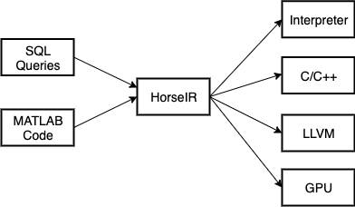

# HorsePower

HorsePower is designed for optimizing database queries with modern hardware.
At its core is **HorseIR**, which is a well-designed array-based intermediate
representation (IR) for database queries.  Based on HorseIR, sophisticated
compiler optimizations can be applied for database operations.  Moreover, using
array programming offers a promising option for performance speedup with
fine-grained parallelism.

## Project Overview

Figure 1. The workflow of the HorsePower framework.

In summer 2017, we started this project from scratch.  The workflow of the
HorsePower framework can be found in Figure 1.
A candidate of the source language is our *HorseIR* language which is an
extension of standard SQL.  The Horse language is designed for data analytics
with extended SQL features.
At the current stage, we adopt execution plans from standard database SQL queries
and MATLAB code.
We provide a front end for parsing and transforming source code to HorseIR.
After the optimization phases, multiple back-ends are supported.
Static analyses and code optimizations are performed before the target code is generated.
On the other hand, we provide an interpreter which allows running programs directly.

In HorsePower, we focus on the following parts.

    - Design and implementation of array-based intermediate representation (IR)
    - Static analysis for an array-based IR (i.e. HorseIR)
    - Query optimizations with compiler optimizations
    - Fine-grained primitive functions and highly tuned libraries

## Installation

Download the repository

    git clone git@github.com:Sable/HorsePower.git

Setup the environment variable `HORSE_BASE`

    cd HorsePower && export HORSE_BASE=$PWD

Installation with the following command line  (About 13 mins)

    (cd libs && sh deploy_linux.sh)

After installation, new folders created as follows.

    - libs/include
    - libs/lib
    - libs/pcre2

Note, it is recommended to use gcc 8.1.0 or higher and additional library
`uuid-dev` may be required during the installation.

### Build and Run

There are multiple versions developing under `src/horseir/`.
For each version, you can find a running script `run.sh` which builds an
executable and runs it with proper parameters.
You are recommended to use the latest version as this project is still under
active development.

To learn how to run, type

    (cd src/horseir/v3 && ./run.sh)      # show usage

### A Brief Summary

| Name                     | Notes                                  |
| :----------------------- | :------------------------------------- |
| Platform                 | Cross-platform                         |
| Tools                    | C/C++, Flex & Bison                    |
| Parallelism              | OpenMP/Pthread/CUDA/OpenCL             |
| Conventions              | [docs/conventions](docs/conventions)   |

## Quick Entries

IR design

- [Official IR design notes](docs/mkdocs/docs/horseir/)
- [IR grammar in a yacc file (v3)](src/horseir/v3/frontend/h.y)
- [IR types and rules](docs/horsetype): see also [specific type rules](http://www.sable.mcgill.ca/~hanfeng.c/horse/docs/horseir/functions/)
- [IR online reference](http://www.sable.mcgill.ca/~hanfeng.c/horse/docs/horseir/)

Database TPC-H

- [TPC-H](docs/tpch)
- [TPC-H examples](tests)

Implementation

- [Details](docs/implementation)
- [Project libraries](libs/)

## Publications

- Hanfeng Chen, Joseph Vinish D’silva, Hongji Chen, Bettina Kemme, and
  Laurie Hendren, [HorseIR: Bringing Array Programming Languages together with
  Database Query Processing](https://dl.acm.org/citation.cfm?id=3276951),
  Proceedings of the 14th Symposium on Dynamic Languages,
  ([DLS '18](https://conf.researchr.org/track/dls-2018/dls-2018)),
  pp. 37-49, November 2018.
    + [BibTeX record on dblp](https://dblp.uni-trier.de/rec/bibtex/conf/dls/ChenDCKH18)
    + [DLS18 artifact on GitHub](https://github.com/Sable/dls18-analysis)

## Copyright and License

Copyright &copy; 2017-2020, Hanfeng Chen, Laurie Hendren and McGill University.

- PCRE2: [PCRE2 Licence](docs/license/pcre2.txt)

<!--
### External Links

Software

- MonetDB : [home](https://www.monetdb.org/Home) | [reference](https://www.monetdb.org/Documentation/SQLreference)
- Q/KDB+  : [kx](kx.com) | [reference](code.kx.com)

About Horse

- [HorseIR design](http://www.sable.mcgill.ca/~hanfeng.c/f17/horse_spec/) | Horse: An array programming language with Database components
- [Horse program](http://www.sable.mcgill.ca/~hanfeng.c/f17/horseir/) | Design of Horse program

Related work

- [Introduction](http://www.sable.mcgill.ca/~hanfeng.c/f17/talk2/slide.html) : A query compiler for IMDB
- [Query compiler](http://www.sable.mcgill.ca/~hanfeng.c/f17/qcompiler/) : Shaikhha et al., How to Architect a Query Compiler, SIGMOD 2016
- LegoBase : Klonatos et al., [Building Efficient Query Engines in a High-Level Language](http://dl.acm.org/citation.cfm?id=2732959), VLDB 2014
- Aquery   : Cambronero and Shasha, AQuery, a query language for order in data analytics: Language, Optimization, and Experiments, to appear

SQL front-end

- [H2 database](http://www.h2database.com/html/grammar.html) | H2: an in-memory db written in Java
- [hyrise/sql-parser](https://github.com/hyrise/sql-parser)

-->
