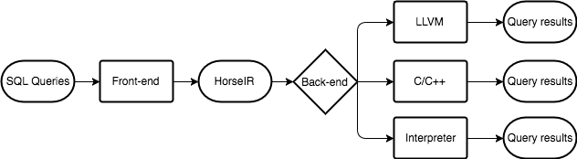

# HorsePower

HorsePower is a set of infrastructures for parsing and optimizing database queries.
It involves all phases of query compilation from source language to execution
plans.  Moreover, it provides a couple of well-designed IRs in array programming
before generating low-level code.  The IRs have multiple levels so that
sophisticated compiler optimizations for each level can be applied.
Furthermore, using array programming offers a promising option for the
fine-grained parallelism.

In HorsePower, we focus on the following parts.

    - Source language design
    - Multiple-level IR design
    - Static analysis for array-based IRs
    - Highly tuned library support
    - Query optimizations with heuristics
    - Query optimizations with data-flow analysis

## Summer 2017

In the summer 2017, we will start this project from scratch.  We have a great team
, Hanfeng and Hongji, with the strong support from Laurie.

We plan to build the system in the first three months (12 weeks). Later, we
could have another month to improve the system and draft a paper.

- Schedule
  + [Hongji](docs/plans/hongji.md)
  + [Hanfeng](docs/plans/hanfeng.md)

### About project

Figure 1. The workflow of Horse framework.

Figure 2. The design of 3 IRs.

### Settings

- Platform       : Cross-platform
- Languages      : C/C++
- Parallelism    : OpenMP/Pthread
- Conventions    : [docs/conventions](docs/conventions)
- GitHub Issue   : [Issues](https://github.com/Sable/HorsePower/issues)

### Resources

- MonetDB : [home](https://www.monetdb.org/Home) | [reference](https://www.monetdb.org/Documentation/SQLreference)
- Q/KDB+  : [kx](kx.com) | [reference](code.kx.com)

### Chat room

[Enter here](https://gitter.im/Sable/HorsePower)

Let's rock the summer 2017!
