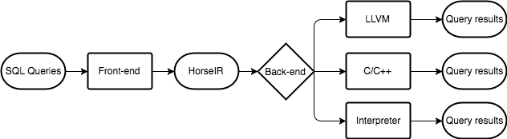

## Overview

<p align="center"></p>
<!--<p align="center">Figure 1. The workflow of HorsePower.</p>-->


HorsePower is a set of infrastructures for parsing and optimizing database queries. It involves all phases of query compilation from high-level source language to low-level code. Moreover, it provides a well-designed IR, HorseIR, in array programming before generating low-level code. Based on HorseIR, sophisticated compiler optimizations can be applied for database operations. Furthermore, using array programming offers a promising option for the fine-grained parallelism.

In HorsePower, we focus on the following parts.

```
- Static analysis for array-based HorseIR
- Highly tuned library support
- High-level source language design
- Query optimizations with heuristics
- Query optimizations with data-flow analysis
```

**Settings**

- Platform       : Cross-platform
- Languages      : C/C++
- Auto tool      : ANTLR4
- Parallelism    : OpenMP/Pthread/CUDA/OpenCL
- GitHub Issue   : [Issues](https://github.com/Sable/HorsePower/issues)