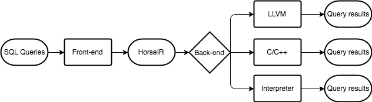

HorsePower provides a set of infrastructures for parsing and optimizing database
queries. It involves all phases of query compilation from high-level source
language to low-level code. Moreover, it provides a well-designed IR, HorseIR,
in array programming before generating low-level code. Based on HorseIR,
sophisticated compiler optimizations can be applied for database operations.
Furthermore, using array programming offers a promising option for the
fine-grained parallelism.

<!--

-->
<!--
Figure 1. The workflow of HorsePower.
-->

### Research ideas

At current stage, we focus on the research ideas as follows.

- High-level source language design
- Fine-grained primitives and highly tuned library
- Static analysis for an array-based IR (i.e. HorseIR)
- Query optimizations with heuristics
- Query optimizations with data-flow analyses

### Settings

- Platform       : Cross-platform
- Languages      : C/C++
- Auto tool      : ANTLR4
- Parallelism    : OpenMP/Pthread/CUDA/OpenCL
- GitHub Issue   : [Issues](https://github.com/Sable/HorsePower/issues)
